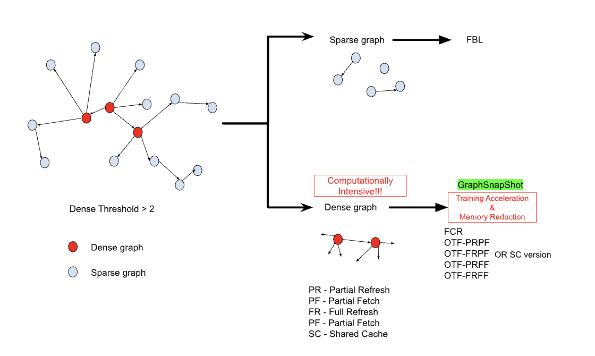
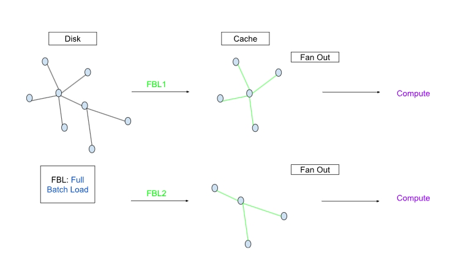

### GraphSnapShot

Up to **30\%** training acceleration and **73\%** memory reduction for lossless graph ML training with GraphSnapShot!

GraphSnapShot is a framework for fast storage, retrieval and computation for graph learning. It can quickly store and update the local topology of graph structure, just like take `snapshots` of the graphs.




3 kinds of system design
```
1. proto - implemented by torch
2. dglsampler-simple - implemented with baseline of MultiLayerSampler in dgl
3. dglsampler - implemented with baseline of MultiLayerSampler in dgl
```

For dglsampler re-design
3 system design strategies
```
FBL: full batch load
OTF: partial cache refresh (on the fly) snapshot
FCR: full cache refresh snapshot
```

In detailed:
```
1. All methods in OTF and FCR has two modes: independent cache and shared cache
2. OTF has 4 methods, which are the combination of (full refresh, partial refresh) x (full fetch, partial fetch)
```

Deployment:

FBL implementation is same as the `MultiLayerSampler` implemented in dgl.

To deploy GraphSnapShot,  Samplers in SSDReS_Sampler by `cd SSDReS_Samplers`, and then find the following file
```
NeighborSampler_OTF_struct.py
NeighborSampler_OTF_nodes.py
NeighborSampler_FCR_struct.py
NeighborSampler_FCR_nodes.py
```

The sampler code can be found at
```shell
vim ~/anaconda3/envs/dglsampler/lib/python3.9/site-packages/dgl/sampling/neighbor.py
```

Add samplers code in SSDReS_Sampler into the neighbor_sampler.py in dgl as in the path above and save the changes.
```shell
vim ~/anaconda3/envs/dglsampler/lib/python3.9/site-packages/dgl/dataloading/neighbor_sampler.py
```
Then you can deploy OTF and FCR samplers at node-level and struct-level from neighbor_sampler and create objects of those samplers.

FBL in execution
```
https://docs.dgl.ai/en/0.8.x/_modules/dgl/sampling/neighbor.html#sample_neighbors
https://docs.dgl.ai/en/0.9.x/generated/dgl.dataloading.NeighborSampler.html
```

FCR in execution

https://github.com/NoakLiu/GraphSnapShot/assets/116571268/ed701012-9267-4860-845b-baf1c39c317c

OTF in execution

https://github.com/NoakLiu/GraphSnapShot/assets/116571268/6fe1a566-d4e9-45ae-b654-676a2e4d6a58

FCR-SC, OTF-SC, FBL comparison (Note: SC is short for shared cache)

https://github.com/NoakLiu/GraphSnapShot/assets/116571268/baed1610-952c-4455-9ecf-015450b482dc


Two types of samplers:
```
node-level: split graph into graph_static and graph_dynamic, enhance the capability for CPU-GPU co-utilization.
structure-level: reduce the inefficiency of resample whole k-hop structure for each node, use static-presample and dynamic-resample for structure retrieval acceleration.
```

Downsteam Task: 
```
MultiLayer GCN - ogbn_arxiv / ogbn_products (homo)
MultiLayer SGC - ogbn_arxiv / ogbn_products (homo)
MultiLayer GraphSAGE - ogbn_arxiv / ogbn_products (homo)
MultiLayer RelGraphConv - ogbn_mag (hete)
```

Datasets:
```
ogbn_arxiv - node classification (homo)
ogbn_products - node classification (homo)
ogbn_mag - node classification (hete)
```

<p align="center">
  
  
  
</p>

| Feature           | OGBN-ARXIV   | OGBN-PRODUCTS | OGBN-MAG      |
|-------------------|--------------|---------------|---------------|
| Dataset Type      | Citation Network | Product Purchase Network | Microsoft Academic Graph |
| Number of Nodes   | 17,735       | 24,019        | 132,534       |
| Number of Edges   | 116,624      | 123,006       | 1,116,428     |
| Feature Dimension | 128          | 100           | 50            |
| Number of Classes | 40           | 89            | 112           |
| Number of Train Nodes       | 9,500        | 12,000        | 41,351        |
| Number of Validation Nodes  | 3,500        | 2,000         | 10,000        |
| Number of Test Nodes        | 4,735        | 10,000        | 80,183        |
| Supervised Task   | Node Classification | Node Classification | Node Classification |

Design of FBL



Design of OTF


Design of FCR


An Example of Memory Reduction for 
Original Graph
```
Graph(num_nodes=169343, num_edges=1166243,
      ndata_schemes={'year': Scheme(shape=(1,), dtype=torch.int64), 'feat': Scheme(shape=(128,), dtype=torch.float32)}
      edata_schemes={})
```
Dense Filter -->Dense Graph (degree>30)
```
Graph(num_nodes=5982, num_edges=65847,
      ndata_schemes={'year': Scheme(shape=(1,), dtype=torch.int64), 'feat': Scheme(shape=(128,), dtype=torch.float32), '_ID': Scheme(shape=(), dtype=torch.int64)}
      edata_schemes={'_ID': Scheme(shape=(), dtype=torch.int64)})
```
Cached Graph (cached for FCRSampler)
```
Graph(num_nodes=5982, num_edges=30048,
      ndata_schemes={'year': Scheme(shape=(1,), dtype=torch.int64), 'feat': Scheme(shape=(128,), dtype=torch.float32), '_ID': Scheme(shape=(), dtype=torch.int64)}
      edata_schemes={'_ID': Scheme(shape=(), dtype=torch.int64)})
```

Overall, achieve a memory reduction from `num_edges=65847` to `num_nodes=5982, num_edges=30048`, edges memory reduction by by 45.6%

Dense Graph GraphSnapShot Cache for SSDReS_Samplers

#### Methods
- For sparse graphs, FBL method will be directedly deployed
- For dense graphs, SSDReS methods will be deployed

#### SSDReS Samplers
- dgl samplers
    - hete
        - FCR_hete
        - FCR_SC_hete
        - OTF((PR, FR)x(PF, FF))_hete
        - OTF((PR, FR)x(PF, FF))_SC_hete
    - homo
        - FCR
        - FCR_SC
        - OTF((PR, FR)x(PF, FF))
        - OTF((PR, FR)x(PF, FF))_SC

- dgl samplers simple
    - hete
        - FCR_hete
        - FCR_SC_hete
        - OTF_hete
        - OTF_SC_hete
    - homo
        - FCR
        - FCR_SC
        - OTF
        - OTF_SC

#### Deployment Sequence
- For homograph
    - 1. python div_graph_by_deg_homo.py --> dense graph, sparse graph
    - 2. deploy homo SSDReS samplers such as FCR, FCR-SC, OTF((PR, FR)x(PF, FF)), OTF((PR, FR)x(PF, FF))-SC on dense graph
    - 3. deploy FBL on sparse graph

- For hetegraph
    - 1. python div_graph_by_deg_hete.py --> dense graph, sparse graph
    - 2. deploy homo SSDReS samplers such as FCR_hete, FCR-SC_hete, OTF((PR, FR)x(PF, FF))_hete, OTF((PR, FR)x(PF, FF))-SC_hete on dense graph
    - 3. deploy FBL on sparse graph

### Figures for Runtime Memory reduction


#### Figures for Memory reduction


#### Figures for GPU reduction


#### Analysis
The key point of GraphSnapShot is to cache the local structure instead of whole graph input for memory reduction and sampling efficiency.


Deployment on homo-graphs
Import
```python
from dgl.dataloading import (
    DataLoader,
    MultiLayerFullNeighborSampler,
    NeighborSampler,
    MultiLayerNeighborSampler,
    BlockSampler,
    NeighborSampler_FCR_struct,
    NeighborSampler_FCR_struct_shared_cache,
    NeighborSampler_OTF_struct_FSCRFCF,
    NeighborSampler_OTF_struct_FSCRFCF_shared_cache,
    NeighborSampler_OTF_struct_PCFFSCR_shared_cache,
    NeighborSampler_OTF_struct_PCFFSCR,
    NeighborSampler_OTF_struct_PCFPSCR_SC,
    NeighborSampler_OTF_struct_PCFPSCR,
    NeighborSampler_OTF_struct_PSCRFCF_SC,
    NeighborSampler_OTF_struct_PSCRFCF,
    # NeighborSampler_OTF_struct,
    # NeighborSampler_OTF_struct_shared_cache

)
```
Method Explanation - homo
```
NeighborSampler_FCR_struct: Fully Cache Refresh, with each hop has unique cached frontier
NeighborSampler_FCR_struct_shared_cache: Fully Cache Refresh with Shared Cache, with all hop has shared cached frontier
NeighborSampler_OTF_struct_FSCRFCF: 
NeighborSampler_OTF_struct_FSCRFCF_shared_cache: 
NeighborSampler_OTF_struct_PCFFSCR: 
NeighborSampler_OTF_struct_PCFFSCR_shared_cache: 
NeighborSampler_OTF_struct_PCFPSCR: 
NeighborSampler_OTF_struct_PCFPSCR_SC: 
NeighborSampler_OTF_struct_PSCRFCF: 
NeighborSampler_OTF_struct_PSCRFCF_SC: 
```
Deployment
```python
# FBL
sampler = NeighborSampler(
    [5, 5, 5],  # fanout for [layer-0, layer-1, layer-2]
    prefetch_node_feats=["feat"],
    prefetch_labels=["label"],
    fused=fused_sampling,
)

# FCR
sampler = NeighborSampler_FCR_struct(
    g=g,
    fanouts=[5,5,5],  # fanout for [layer-0, layer-1, layer-2] [2,2,2]
    alpha=1.5, T=50,
    prefetch_node_feats=["feat"],
    prefetch_labels=["label"],
    fused=fused_sampling,
)


# FCR shared cache
sampler = NeighborSampler_FCR_struct_shared_cache(
    g=g,
    fanouts=[5,5,5],  # fanout for [layer-0, layer-1, layer-2] [2,2,2]
    alpha=1.5, T=50,
    prefetch_node_feats=["feat"],
    prefetch_labels=["label"],
    fused=fused_sampling,
)    

# OTF
sampler = NeighborSampler_OTF_struct_FSCRFCF(
    g=g,
    fanouts=[5,5,5],  # fanout for [layer-0, layer-1, layer-2] [4,4,4]
    amp_rate=2, refresh_rate=0.3, T=50, #3, 0.4
    prefetch_node_feats=["feat"],
    prefetch_labels=["label"],
    fused=fused_sampling,
)

# OTF shared cache
sampler = NeighborSampler_OTF_struct_FSCRFCF_shared_cache(
    g=g,
    fanouts=[5,5,5],  # fanout for [layer-0, layer-1, layer-2] [2,2,2]
    # alpha=2, beta=1, gamma=0.15, T=119,
    amp_rate=2, refresh_rate=0.3, T=50,
    prefetch_node_feats=["feat"],
    prefetch_labels=["label"],
    fused=fused_sampling,
)

# OTF FSCR FCF shared cache
sampler = NeighborSampler_OTF_struct_PCFFSCR_shared_cache(
    g=g,
    fanouts=[5,5,5],
    amp_rate=2,fetch_rate=0.3,T_fetch=10
)

# OTF FSCR FCF
sampler = NeighborSampler_OTF_struct_PCFFSCR(
    g=g,
    fanouts=[5,5,5],
    amp_rate=2,fetch_rate=0.3,T_fetch=10
)

# PCF PSCR SC
sampler = NeighborSampler_OTF_struct_PCFPSCR_SC(
    g=g,
    fanouts=[5,5,5],
    amp_rate=2,refresh_rate=0.3,T=10
)

# PCF PSCR
sampler = NeighborSampler_OTF_struct_PCFPSCR(
    g=g,
    fanouts=[5,5,5],
    amp_rate=2,refresh_rate=0.3,T=50
)

# PSCR FCF SC
sampler = NeighborSampler_OTF_struct_PSCRFCF_SC(
    g=g,
    fanouts=[5,5,5],
    amp_rate=2, refresh_rate=0.3, T=50
)
```

Deployment on hete-graphs
Import
```python
from dgl.dataloading import(
    MultiLayerNeighborSampler,
    DataLoader,
    MultiLayerFullNeighborSampler,
    NeighborSampler_FCR_struct_hete,
    NeighborSampler_FCR_struct_shared_cache_hete,
    NeighborSampler_OTF_refresh_struct_hete,
    NeighborSampler_OTF_refresh_struct_shared_cache_hete,
    NeighborSampler_OTF_fetch_struct_hete,
    NeighborSampler_OTF_fetch_struct_shared_cache_hete,
    NeighborSampler_OTF_struct_PCFPSCR_hete,
    NeighborSampler_OTF_struct_PCFPSCR_shared_cache_hete,
    NeighborSampler_OTF_struct_PSCRFCF_hete,
    NeighborSampler_OTF_struct_PSCRFCF_shared_cache_hete,

    # modify_NeighborSampler_OTF_refresh_struct_shared_cache_hete
    # FCR_hete,
)
```
Method Explanation
```
NeighborSampler_FCR_struct_hete: 
NeighborSampler_FCR_struct_shared_cache_hete
NeighborSampler_OTF_refresh_struct_hete
NeighborSampler_OTF_refresh_struct_shared_cache_hete
NeighborSampler_OTF_fetch_struct_hete
NeighborSampler_OTF_fetch_struct_shared_cache_hete
NeighborSampler_OTF_struct_PCFPSCR_hete
NeighborSampler_OTF_struct_PCFPSCR_shared_cache_hete
NeighborSampler_OTF_struct_PSCRFCF_hete
NeighborSampler_OTF_struct_PSCRFCF_shared_cache_hete
```
Deployment
```python
sampler = NeighborSampler_FCR_struct_hete(
    g=g,
    fanouts=[25,20],  # fanout for [layer-0, layer-1, layer-2] [4,4,4]
    alpha=2, T=10, # 800
    hete_label="paper",
    # prefetch_node_feats=["feat"],
    # prefetch_labels=["label"],
    # fused=True,
)

sampler = NeighborSampler_FCR_struct_shared_cache_hete(
    g=g,
    fanouts=[25,20],  # fanout for [layer-0, layer-1, layer-2] [4,4,4]
    alpha=2, T=10, # 800
    hete_label="paper",
)

sampler = NeighborSampler_OTF_refresh_struct_hete(
    g=g,
    fanouts=[25,20],
    alpha=2,
    T=20,
    refresh_rate=0.4,
    hete_label="paper"
)

sampler = NeighborSampler_OTF_refresh_struct_shared_cache_hete(
    g=g,
    fanouts=[25,20],
    alpha=2,
    T=20,
    refresh_rate=0.4,
    hete_label="paper"
)

sampler = NeighborSampler_OTF_fetch_struct_hete(
    g=g,
    fanouts=[25,20],
    amp_rate=1.5,
    T_refresh=20,
    T_fetch=3,
    hete_label="paper"
)

sampler = NeighborSampler_OTF_fetch_struct_shared_cache_hete(
    g=g,
    fanouts=[25,20],
    amp_rate=1.5,
    fetch_rate=0.4,
    T_fetch=3,
    T_refresh=20,
    hete_label="paper"
)

sampler = modify_NeighborSampler_OTF_refresh_struct_shared_cache_hete(
    g=g,
    fanouts=[25,20],
    amp_rate=1.5,
    fetch_rate=0.4,
    T_fetch=3,
    T_refresh=20,
)

sampler = NeighborSampler_OTF_struct_PCFPSCR_hete(
    g=g,
    fanouts=[25,20],
    amp_rate=1.5,
    refresh_rate=0.4,
    T=50,
    hete_label="paper",
)

sampler = NeighborSampler_OTF_struct_PCFPSCR_shared_cache_hete(
    g=g,
    fanouts=[25,20],
    amp_rate=1.5,
    refresh_rate=0.4,
    T=50,
    hete_label="paper",
)

sampler = NeighborSampler_OTF_struct_PSCRFCF_hete(
    g=g,
    fanouts=[25,20],
    amp_rate=1.5,
    refresh_rate=0.4,
    T=50,
    hete_label="paper",
)

sampler = NeighborSampler_OTF_struct_PSCRFCF_shared_cache_hete(
    g=g,
    fanouts=[25,20],
    amp_rate=1.5,
    refresh_rate=0.4,
    T=50,
    hete_label="paper",
)
```

#### Experimental Results

FBL
setting
```
'ogbn-products', threshold=30
sampler = NeighborSampler(
    [5, 5, 5],  # fanout for [layer-0, layer-1, layer-2]
    # prefetch_node_feats=["feat"],
    # prefetch_labels=["label"],
    # fused=fused_sampling,
)
```
```
lstime.mean (s): 0.014647597649449685
lsmem.mean (MB): 0.24154361263736263
Epoch 00002 | Loss 0.0000 | Time 15.8059
sampler memory (MB): 0.0
sampler comp (MB): 791.25
```

Time reduction in FCR
FBL
FCR setting1
```
'ogbn-products', threshold = 30
sampler = NeighborSampler_FCR_struct(
    g=g,
    fanouts=[5,5,5],  # fanout for [layer-0, layer-1, layer-2] [2,2,2]
    alpha=1.5, T=50,
    # prefetch_node_feats=["feat"],
    # prefetch_labels=["label"],
    # fused=fused_sampling,
)
```
```
lstime.mean (s): 0.011630635267357832
lsmem.mean (MB): -0.03964915293040293
Epoch 00002 | Loss 0.0000 | Time 12.6349
sampler memory (MB): 1548.828125
sampler comp (MB): 1418.953125
```
FCR setting2
FCR setting3
FCR setting4
FCR setting5

Time reduction in OTF(PF, FF)x(PR, FR)
FBL
解释 PF, PR含义,对于构建application(同质化的体验，还是集中的使用)
OTF(PF, FF)x(PR, FR) settings

Time reduction with refresh rate, fetch rate, T_fetch, T_refresh
refresh rate setting1
refresh rate setting2
refresh rate setting3
refresh rate setting4
refresh rate setting5

fetch rate setting1
fetch rate setting2
fetch rate setting3
fetch rate setting4
fetch rate setting5

Analysis: why

Memory reduction for shared cache mode
    shared cache 画图解释
    1. FCR, FCR-SC
    2. OTF, OTF-SC

Analysis: why

Memory reduction with amplication rate
    amplication rate画图解释, with refresh and fetch

Analysis: why

Accuracy Ablation

Analysis: why

Accuracy Ablation with refresh rate, fetch rate, T_fetch, T_refresh

Analysis: why

伪代码